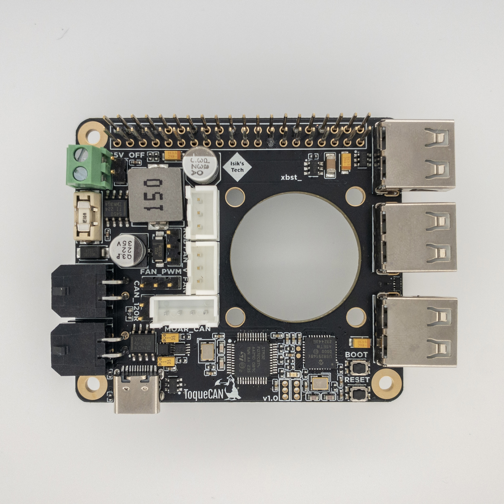

# 

ToqueCAN is an open-source Raspberry Pi toque* with:
- A CAN transceiver with 2x CAN connectors
- 3 port USB hub
- 24V to 5V 5A regulator for powering the Pi and USB devices
- Pi cooling fan (30mm or 40mm) mount with PWM speed control
- Neopixel control
- GPIO passthrough
- Supports Klipper and Candlelight firmwares

Designed for 3D printers with many CAN devices, 24V power and small electronics chambers.

*Almost like a hat, no EEPROM.

## YouTube Video

## Purchasing a ToqueCAN
### United States
- [Isik's Tech](https://store.isiks.tech/products/toquecan) (Me)
- [Amazon - Prime Shipping](https://www.amazon.com/dp/B0D33F7GBZ?maas=maas_adg_4BCCA12678B30071A84EF6315FF9BF74_afap_abs&ref_=aa_maas&tag=maas)
- [West3D](https://west3d.com/products/toquecan-pi-toque-with-2xcan-and-24v-5v-regulator?_pos=1&_psq=Toque&_ss=e&_v=1.0)
### European Union
- [Lab4450 - Portugal](https://lab4450.com/product/toquecan-pi-by-xbst_/)

This project is licensed under [GPL v3](./LICENSE), meaning vendors are allowed to sell PCBs without paying me. If you'd like to support the development of this and future projects please consider [sponsoring](https://github.com/sponsors/xbst) me on GitHub. You can also subscribe on [Patreon](https://l.isiks.tech/patreon) or [YouTube](https://l.isiks.tech/member).

You can also use the included gerber files to order your own from a PCB manufacturer like [PCBWay](https://www.pcbway.com/setinvite.aspx?inviteid=374841) or [JLCPCB](https://jlcpcb.com/).
 

## [Instructions](./Docs/ToqueCAN-Manual.pdf)
Click the above link to download the ToqueCAN manual (PDF).

## YouTube

I am a YouTube content creator. If you want content about these projects & more, please consider [subscribing to my YouTube channel](https://www.youtube.com/channel/UClAWYmCkHjsbaX9Wz1df2mg).
 

If you feel like contributing to the development of this project and other projects like this you can sponsor me on [GitHub](https://github.com/sponsors/xbst), subscribe on [Patreon](https://l.isiks.tech/patreon) or [YouTube](https://l.isiks.tech/member).

## Notes
- Markdown files in this repository may contain Amazon Associate, Aliexpress affiliate, PCBWay affiliate, Jawstec affiliate, Polymaker affiliate links. I make a comission on qualifying purchases.
- This project does not come with any warranty, if you choose to build/use a PCB manufactured using published files in this repository, you are doing this at your own risk!
- If you want to sell PCBs manufactured using published files in this repository, you are allowed to, and you will not owe me any royalties. **You cannot claim that I endorse the sale**. You can check the license file for more information. However, if you **wish** to give me a share you can sponsor me on [GitHub](https://github.com/sponsors/xbst), subscribe on [Patreon](https://l.isiks.tech/patreon) or [YouTube](https://l.isiks.tech/member).
